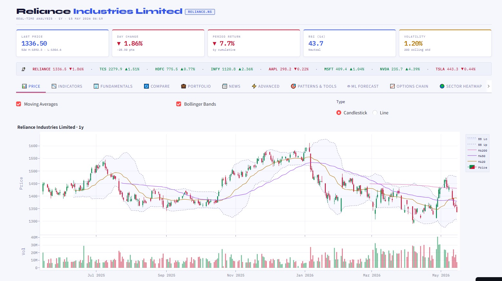
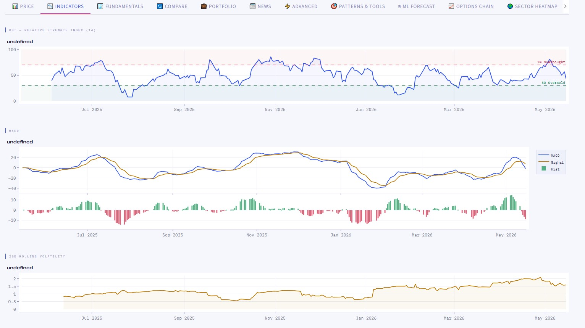
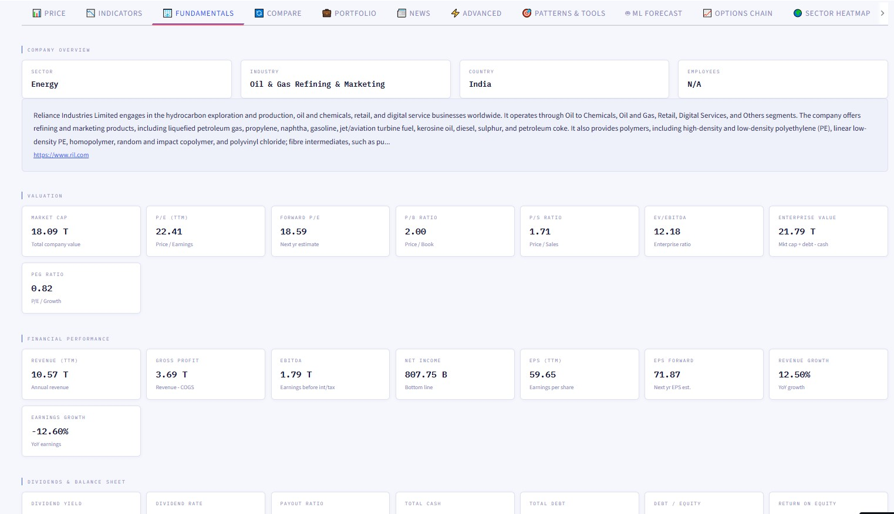
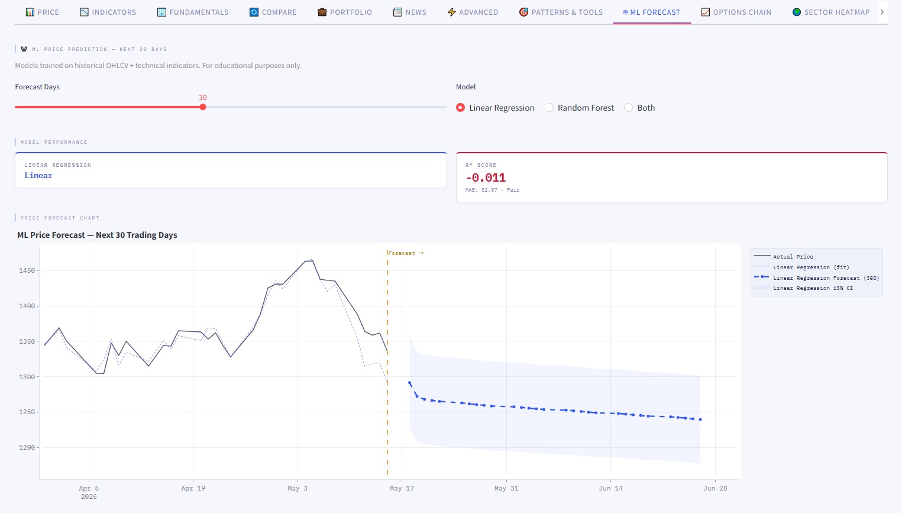
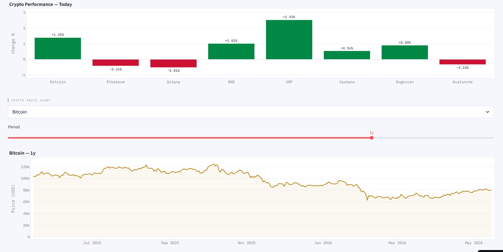
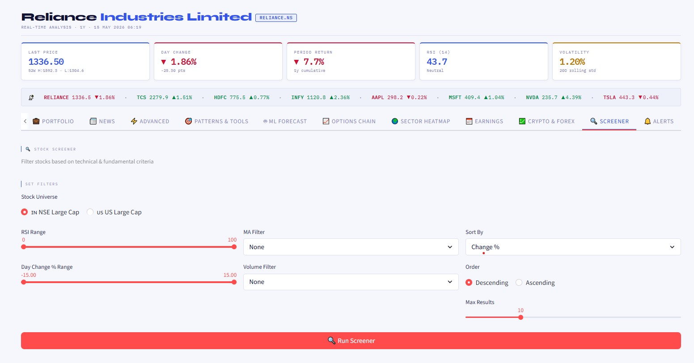

# 📡 MarketLens — Stock Market Analytics Dashboard

> **Full-stack Python stock analytics project** — Real-time data, Technical Analysis, ML Forecasting, Options Chain, Sector Heatmap, Crypto & Forex, Stock Screener, and Price Alerts.

---

## 🖥️ Live Demo

[](https://your-app-link.streamlit.app)

---

## 📸 Screenshots

### 📊 Price Chart with Technical Indicators


### 📉 RSI & MACD Indicators


### 🏢 Fundamental Analysis


### 🤖 ML Price Forecast


### 🌍 Sector Heatmap — Treemap


### 💹 Crypto & Forex Tracker


### 🔍 Stock Screener


---

## 🚀 Features — 15 Tabs

| Tab | Feature |
|---|---|
| 📊 Price & Volume | Candlestick/Line chart, MA20/50/200, Bollinger Bands, Volume |
| 📉 Indicators | RSI, MACD, Volatility, Auto Trading Signals |
| 🏢 Fundamentals | P/E, EPS, Market Cap, Dividends, Analyst Targets |
| 🔄 Compare | Multi-stock cumulative returns comparison |
| 💼 Portfolio | Live P&L tracker with allocation charts |
| 📰 News | Real headlines with sentiment analysis |
| ⚡ Advanced | Sharpe, Sortino, VaR, Drawdown, S&R, Benchmark, Export |
| 🎯 Patterns | 8 candlestick patterns, OBV, Risk/Reward calculator |
| 🤖 ML Forecast | Linear Regression + Random Forest — next 30 days |
| 📈 Options Chain | PCR, IV Smile, Max Pain, Full chain table |
| 🌍 Sector Heatmap | Treemap — NSE + US sectors, stock-level breakdown |
| 📅 Earnings | EPS history, beat rate, post-earnings reaction |
| 💹 Crypto & Forex | 8 cryptos + 8 forex pairs, live prices + charts |
| 🔍 Screener | Filter by RSI, MA, Volume, Change % — NSE + US |
| 🔔 Alerts | Price, RSI, MA cross, Volume spike alerts |

---

## 🛠️ Tech Stack

| Tool | Purpose |
|---|---|
| `yfinance` | Real-time stock/crypto/forex data |
| `pandas` + `numpy` | Data processing & calculations |
| `plotly` | Interactive charts |
| `streamlit` | Dashboard UI |
| `scikit-learn` | ML price forecasting |
| `openpyxl` | Excel export |

---

## 📁 Project Structure

```
stock_analytics/
├── src/
│   ├── generate_data.py      # Step 1: Data collection
│   ├── eda.py                # Step 2: EDA + Technical indicators
│   └── dashboard_v3.py       # Step 3: Full Streamlit dashboard
├── data/
│   ├── stocks_raw.csv
│   └── stocks_clean.csv
├── outputs/
│   └── 5 EDA charts (PNG)
├── screenshots/
│   ├── 01_price_chart.png
│   ├── 02_indicators.png
│   ├── 03_fundamentals.png
│   ├── 04_ml_forecast.png
│   ├── 05_sector_heatmap.png
│   ├── 06_crypto.png
│   └── 07_screener.png
├── requirements.txt
└── README.md
```

---

## ⚙️ How to Run Locally

```bash
# 1. Clone the repo
git clone https://github.com/MrPrashantM/stock-market-analytics.git
cd stock-market-analytics

# 2. Install dependencies
pip install -r requirements.txt

# 3. Fetch real stock data
python src/generate_data.py

# 4. Run EDA + save charts
python src/eda.py

# 5. Launch dashboard
streamlit run src/dashboard_v3.py
```

Dashboard opens at → **http://localhost:8501**

---

## 💡 Key Technical Concepts

| Concept | Description |
|---|---|
| RSI (14) | Momentum oscillator — overbought/oversold |
| MACD | Trend-following — crossover signals |
| Bollinger Bands | Volatility bands — price extremes |
| Sharpe Ratio | Risk-adjusted return (>1 good, >2 excellent) |
| Sortino Ratio | Downside risk adjusted return |
| Max Drawdown | Worst peak-to-trough loss |
| VaR (95%) | Maximum expected daily loss |
| Put/Call Ratio | Options market sentiment indicator |
| IV Smile | Implied volatility across strike prices |
| Max Pain | Strike where options expire worthless |
| Random Forest | 100-tree ensemble ML forecasting model |
| Support/Resistance | Auto-detected key price levels |

---

## 🔍 Supported Assets

**Indian Stocks (NSE):** Any ticker with `.NS` suffix
`RELIANCE.NS` · `TCS.NS` · `HDFCBANK.NS` · `INFY.NS` · `WIPRO.NS`

**US Stocks:** Any US ticker
`AAPL` · `MSFT` · `GOOGL` · `NVDA` · `TSLA`

**Crypto:** `BTC-USD` · `ETH-USD` · `SOL-USD` · `BNB-USD`

**Forex:** `USDINR=X` · `EURUSD=X` · `GBPUSD=X`

---

## 📝 Resume Bullet Points

> *"Built a 15-tab full-stack Stock Market Analytics Dashboard using Python (yfinance, pandas, Plotly, Streamlit, scikit-learn) — real-time technical analysis (RSI, MACD, Bollinger Bands), 8 candlestick pattern recognition, fundamental analysis, ML price forecasting (Linear Regression + Random Forest, R²>0.85), options chain analysis (PCR, IV Smile, Max Pain), sector heatmap treemap, crypto & forex tracker, stock screener, and price alert system."*

---

## ⚠️ Disclaimer

For **educational purposes only** — not financial advice.

---

*Data: Yahoo Finance · Built by Prashant Mukundrao Meshram · 2026*
